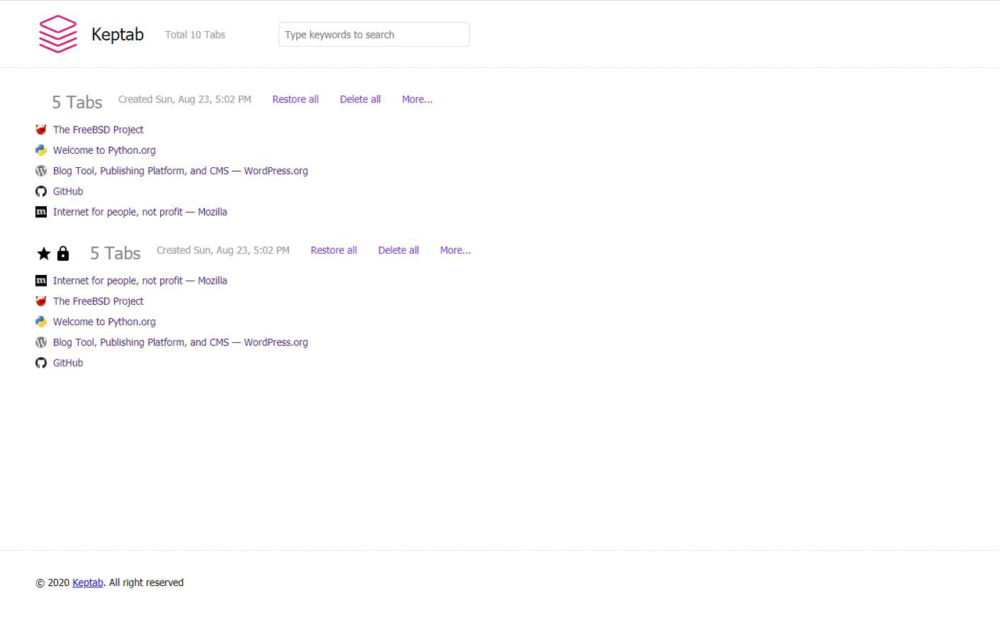

* toc
{:toc}

## Overview

The changelog about Keptab browser extensions.

## Dark Mode! Version: 0.3, Release: 2021/04/18

|     Platform     |      Version     |      Release     |     Download     |
|:----------------:|:----------------:|:----------------:|:----------------:|
|      Chrome      |       v0.3       |     2021/04/18   |  [keptab-chrome-webstore-v0.3-r20210418](../media/download/keptab-chrome-webstore-v0.3-r20210418.zip)  |
|  Microsoft Edge  |       v0.3       |     2021/05/30   |  [keptab-microsoft-edge-addons-v0.3-r20210530](../media/download/keptab-chrome-webstore-v0.3-r20210418.zip)  |

The version v0.3 added dark mode, you can let keptab follow the browser's color schema or just make it as dark/light mode.

### New Release as Microsoft Edge Addons

The version v0.3 is first release at [Microsoft Edge Addons](https://microsoftedge.microsoft.com/addons/keptab) at 2021/05/30.

## Bug Fixed, Version: 0.2, Release: 2020/09/13

|     Platform     |      Version     |      Release     |     Download     |
|:----------------:|:----------------:|:----------------:|:----------------:|
|      Chrome      |       v0.2       |     2020/09/13   |  [keptab-chrome-webstore-v0.2-r20200913](../media/download/keptab-chrome-webstore-v0.2-r20200913.zip)  |

The version v0.2 is bug fixed, with fixed as follow

- Fixed: Keptab Options startupLaunch does not work.
- Fixed: Keptab ContextMenus send left/right/both side tabs does not work.

## Initial Release! Version: 0.1, Release: 2020/08/23

|     Platform     |      Version     |      Release     |     Download     |
|:----------------:|:----------------:|:----------------:|:----------------:|
|      Chrome      |       v0.1       |     2020/08/23   |  [keptab-chrome-webstore-v0.1-r20200823](../media/download/keptab-chrome-webstore-v0.1-r20200823.zip)  |

The version v0.1 is first release version and released at 2020/08/23. Project Keptab is a smart tabs manager for you. We named this just as kept tabs, which means you can keep tabs anywhere, anytime and anyhow.

You can get an introduction from the blog post [Introducing Project Keptab](http://blog.keptab.com/introducing-project-keptab.html). Project Keptab has instance search with magic, that is really fast and really powerful search!

First initial release is chrome version and you can download at [Chrome Webstore](https://chrome.google.com/webstore/detail/keptab/feodekcipceogpeomnijgmdlmocbggbi).

